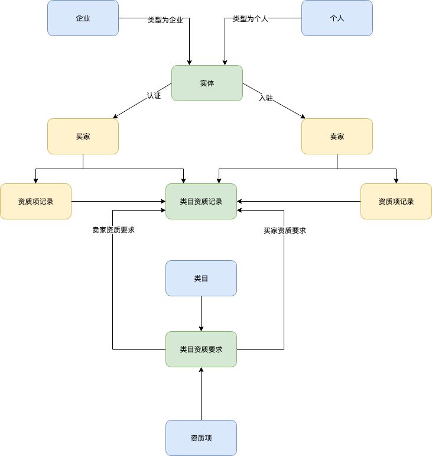

# wr-modeling-process-exapmle
建模过程示例，资质与企业模块的建模过程

## 在下的建模过程如下（各位大佬可以一起探讨）

1. 从业务需求中提炼关键问题
2. 由问题中提炼实体/对象、动作、关系(强实体、弱实体)
3. 对实体或关系抽象化
4. 列出实体的关键属性
5. 梳理关键属性变更造成的业务流变更，完善和验证设计

## 示例：某B2B项目中，企业资质模块建模过程

### 第一步，提炼关键问题
1. 企业的入驻需要通过企业认证，并经审核。
2. 企业销售或购买产品要有各自相应的资质认证，并经审核。
3. 企业之前买某个卖家类目下的产品需要先申请合作，并经审核。
4. 设计要保证后期可向C端个人用户开放。

### 第二步，提炼实体/对象、动作、关系

### 第三步，对实体或关系抽象化

### 第四步，列出实体的关键属性

### 第五步，梳理关键属性变更造成的业务流变更，完善和验证设计

## 此外
- 这些步骤有些地方需要反复斟酌，拿捏不定时可以找老大或者师兄指点一下，尽量将问题解决在会议之下，而不是评审会议时。
- 自己验证没问题后，可以找老大查看一下，是否存在明显问题，无大问题，即可开始设计数据库。
- ok，这就是在下的建模经验了，分享给各位看官
